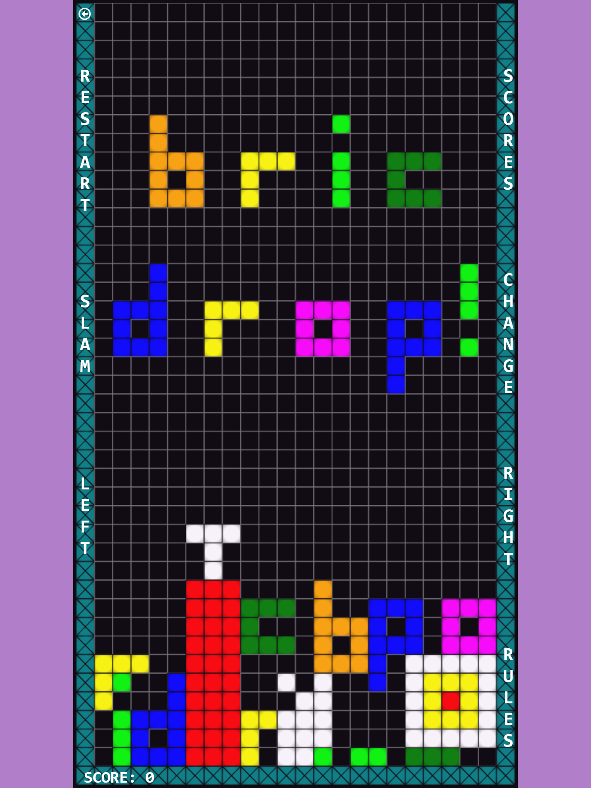
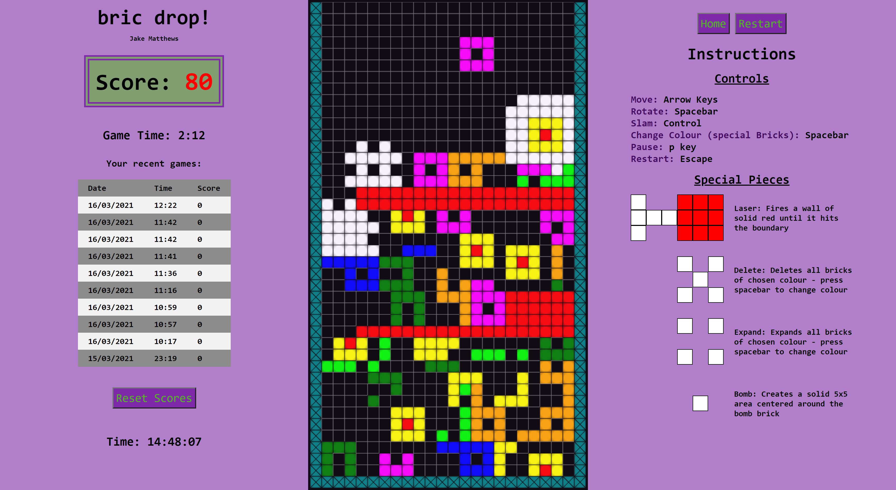
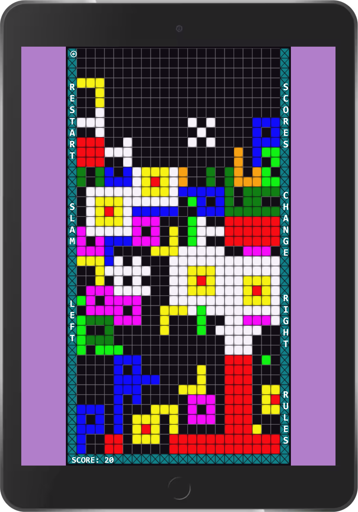
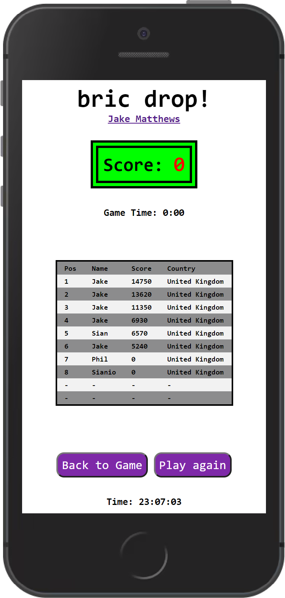

# Bric Drop

A web-based Javascript falling-blocks game.

## Table of contents

- [General Information](#general-information)
- [Sample Images](#sample-images)
- [Technologies Used](#technologies-used)
- [Setup](#setup)
- [Features](#features)
- [Current Status](#current-status)
- [Contact](#contact)

## General information

The aim of this project was to gain experience using HTML, CSS and Javascript, none of which I had any prior experience with. I wanted to create a web application as prior to this all of my code projects were desktop apps that are more difficult to share. I had previously made a falling-blocks type game using Windows Forms - the main challenge in this new project was to implement a game with a new language and without the functionality built into the .Net Framework.

The site is drawn on a single page of HTML, with all logic written in vanilla Javascript with no dependencies. The main component in the centre (on wider screens) is the actual playing grid, with a panel to the right displaying the instructions. Input is taken either through key press (full screen mode), or through clicking on buttons around the edge of the playing grid (mobile/tablet).There is a also a scoreboard - this was originally unique to each player and held in localStorage on each player's machine. It has since been hosted as a Heroku PostgrSQL database serviced by Express & Node.

The playing grid is drawn using a canvas element, which is updated at the appropriate time. There are 11 game pieces, 7 of which are the letters b, r, i, c, d, o and p from the game title - these can be moved and rotated. The remaining 4 pieces have special functions, and some of them can change colour. The objective is to complete rows on the grid, at which point the cells occupying that row are erased. Points are awarded based on the number of rows cleared, where score+=10*(number of rows cleared)^2 - it is possible to clear large numbers of rows at once using the special bricks to achieve higher scores. The game ends when a GamePiece blocks a cell at the top of the playing grid.

## Sample Images

#### FullScreen game in progress:

#### iPad game layout:

#### Scoreboard on mobile:

## Technologies Used

- HTML5
- CSS3
- Javascript
- Node.js
- Express.js
- PostgreSQL

## Setup

The game can be played on my website at: https://www.bricdrop.com. The frontend consists of an index.html file with 4 css stylesheets and a single javascript file. The backend uses Node and Express to interact with a Heroku PostgreSQL database.

## Code Example

#### The following recursive function is the logic that determins how far the current active gamePiece can move in any direction before colliding with something. The integer it returns is then used to decide if a gamePiece needs to be fixed in place, if it can be rotated, or if it can move laterally without causing a collision It takes two arguments - the collisionDistance integer that it increments and returns, and the direction of movement:

    function checkCollision(collisionDistance, direction) {

        collisionDistance++; //incremented each time it runs though the loop
        
        if (activePiece.topRowPos - collisionDistance === 0) {return collisionDistance;} //avoid going below row 0 when checking rows above the activePiece
        
        let dy = 0; //vertical offset
        let dx = 0; //horizontal offset

        switch (direction) {
            case "up":
            dy = -collisionDistance;
            break;
            case "down":
            dy = collisionDistance;
            break;
            case "left":
            dx = -collisionDistance;
            break;
            case "right":
            dx = collisionDistance;
            break;
        }

        for (let row = 0; row < activePiece.arr.length; row++) {    //check through every cell in the bool array of the activePiece to see if it contains a block
            for (let column = 0; column < activePiece.arr[row].length; column++) {
                if (activePiece.arr[row][column] === true) {                    //block present in activePiece - need to check if anything else is present
                    if (wordArray[activePiece.topRowPos + row + dy][activePiece.leftColumnPos + column + dx]) {         //collision detected
                        return collisionDistance - 1; //wordArray at this position not null -> collision detected after x moves -> collision distance is x-1
                    }
                }
            }
        }
        return checkCollision(collisionDistance, direction);    //no collision found - repeat loop until collision detected with another piece or a wall block
    }

## Features

Some things I like about the project:

- The evolution of the scoreboard from a very simple but non-sharable localStorage solution to a (still simple) hosted database.
- The way the game logic and imagery is built from very basic components with no dependencies or images at all.
- Special bricks open up more complex strategies to get high scores, making the gameplay more interesting.
- On the browsers & device I have tested (chrome/safara, android/IOS) and using some testing tools (BrowserStack, Responsinator) the display responds well
- It is fun and addictive to play

New features that could be added / things that could be improved:

- The layout of the page is clumsy due to it being my first experience with HTML and CSS. It should be rewritten to make it better looking and more responsive.
- Constantly redrawing the whole game canvas seems sub-optimal. React components could be used to limit the redrawing to only parts that need tp be updated.

The project has made me aware of the number of devices and display settings out there, and the issues that can arise when trying to cater to these. The process of testing different devices/browsers was not as obvious as I anticipated (absent having the actual devices to hand), especially when the browser testing tools I used did not always closely replicate how content is actually displayed.

## Current Status

The game is hosted at https://www.bricdrop.com.

## Contact

For more information, please contact [@JakeMatthewsUK](https://www.jakematthews.uk/).
